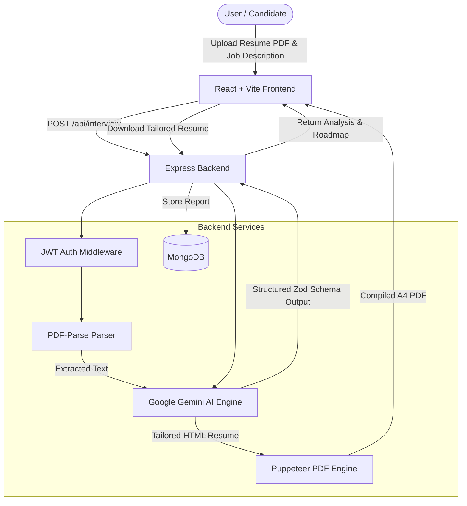

# 🎯 InterviewAI — AI-Powered Interview Prep & Resume Optimizer

<div align="center">


**An intelligent full-stack career acceleration platform that analyzes job descriptions against your resume, calculates role match percentage, identifies skill gaps, formulates tailored technical & behavioral interview questions, designs a day-by-day prep roadmap, and dynamically renders ATS-friendly PDF resumes using Google Gemini AI.**

[Key Features](#-key-features) • [System Architecture](#-system-architecture) • [Tech Stack](#-tech-stack) • [Getting Started](#-getting-started) • [Environment Variables](#-environment-variables) • [API Reference](#-api-reference) • [Project Structure](#-project-structure) • [Pushing to GitHub](#-uploading-to-github)

</div>

---

## ✨ Key Features

- **📊 Intelligent Match Scoring**: Real-time evaluation (0–100%) indicating how strongly a candidate's background matches a given job description.
- **🔍 Skill Gap Analysis**: Uncovers missing or weak qualifications, categorized by impact severity (`Low`, `Medium`, `High`) to prioritize learning.
- **💡 Role-Specific Interview Questions**:
  - **Technical Questions**: Curated technical questions, interviewer intentions, and detailed model answers with key concepts to hit.
  - **Behavioral Questions**: Situational questions with evaluation context and structured response guidance.
- **🗺️ Day-Wise Preparation Roadmap**: An actionable, step-by-step preparation plan broken down by day, focus areas, and targeted tasks.
- **📄 ATS-Optimized Resume PDF Generation**: Generates customized, job-tailored resume content rendered into an ATS-compliant, downloadable A4 PDF using headless **Puppeteer**.
- **📑 Multi-Format Profile Input**: Upload existing resumes in PDF format (parsed using `pdf-parse`) or provide a quick self-description.
- **🔐 Secure Authentication**: JWT-based authentication using HTTP-only cookies, password encryption via `bcryptjs`, and server-side token blacklisting for safe logouts.
- **📁 Dashboard & History**: Save, track, and revisit previous interview strategy reports at any time.

---

## 🏗️ System Architecture



---

## 🛠️ Tech Stack

### Frontend
- **Framework**: [React 19](https://react.dev/) + [Vite](https://vitejs.dev/)
- **Routing**: [React Router v7](https://reactrouter.com/)
- **Styling**: Modern [Sass (SCSS)](https://sass-lang.com/) with custom responsive UI design
- **HTTP Client**: [Axios](https://axios-http.com/) (with cookie-based credentials)

### Backend
- **Runtime & Framework**: [Node.js](https://nodejs.org/) & [Express 5](https://expressjs.com/)
- **Database**: [MongoDB](https://www.mongodb.com/) via [Mongoose ODM](https://mongoosejs.com/)
- **Generative AI**: [@google/genai](https://www.npmjs.com/package/@google/genai) (Google Gemini Flash models)
- **Validation & Schemas**: [Zod](https://zod.dev/) & [zod-to-json-schema](https://www.npmjs.com/package/zod-to-json-schema)
- **Document Processing**: [pdf-parse](https://www.npmjs.com/package/pdf-parse) (resume extraction) & [Puppeteer](https://pptr.dev/) (headless PDF rendering)
- **Authentication**: [JSON Web Tokens (JWT)](https://jwt.io/) & [bcryptjs](https://www.npmjs.com/package/bcryptjs)
- **File Uploads**: [Multer](https://github.com/expressjs/multer) (in-memory buffer processing)

---

## 📂 Project Structure

```text
interview-ai/
├── Backend/
│   ├── src/
│   │   ├── config/
│   │   │   └── database.js            # MongoDB connection configuration
│   │   ├── controllers/
│   │   │   ├── auth.controller.js      # Auth logic (register, login, logout, getMe)
│   │   │   └── interview.controller.js # Report generation & PDF controllers
│   │   ├── middlewares/
│   │   │   ├── auth.middleware.js      # JWT authentication & blacklist verification
│   │   │   └── file.middleware.js      # Multer memory storage configuration
│   │   ├── models/
│   │   │   ├── blacklist.model.js      # Blacklisted JWT tokens
│   │   │   ├── interviewReport.model.js# Interview reports schema
│   │   │   └── user.model.js           # User credentials schema
│   │   ├── routes/
│   │   │   ├── auth.routes.js          # Authentication routing endpoints
│   │   │   └── interview.routes.js     # Interview and resume generation endpoints
│   │   ├── services/
│   │   │   └── ai.service.js           # Google Gemini AI prompts & Puppeteer PDF generator
│   │   └── app.js                      # Express application setup & middleware
│   ├── .env.example                    # Sample environment variables
│   ├── package.json
│   └── server.js                       # Backend entry point (Port: 3000)
│
├── Frontend/
│   ├── src/
│   │   ├── features/
│   │   │   ├── auth/                   # Login, Register, Protected route, Auth context
│   │   │   └── interview/              # Home form, Report viewer, Roadmap, API hooks
│   │   ├── app.routes.jsx              # Client router configuration
│   │   ├── main.jsx                    # React entry root
│   │   └── style.scss                  # Global design tokens and resets
│   ├── package.json
│   ├── vite.config.js
│   └── index.html
│
├── .gitignore                          # Root Git ignore rules
└── README.md                           # Documentation
```

---

## 🚀 Getting Started

### Prerequisites

Ensure you have the following installed on your system:
- [Node.js](https://nodejs.org/) (v18.x or later recommended)
- [MongoDB](https://www.mongodb.com/) (running locally or a [MongoDB Atlas](https://www.mongodb.com/atlas) connection URI)
- [Google Gemini API Key](https://aistudio.google.com/app/apikey)

---

### 1. Clone the Repository

```bash
git clone https://github.com/YOUR_USERNAME/interview-ai.git
cd interview-ai
```

---

### 2. Backend Setup

1. Navigate to the `Backend` directory:
   ```bash
   cd Backend
   ```

2. Install dependencies:
   ```bash
   npm install
   ```

3. Configure environment variables:
   Copy `.env.example` to create your `.env` file:
   ```bash
   cp .env.example .env
   ```
   Open `.env` and provide your secrets:
   ```env
   PORT=3000
   MONGO_URI=mongodb://localhost:27017/interview-ai
   JWT_SECRET=your_jwt_secret_key_here
   GOOGLE_GENAI_API_KEY=your_google_gemini_api_key_here
   ```

4. Start the backend development server:
   ```bash
   npm run dev
   ```
   *The backend will start on `http://localhost:3000`.*

---

### 3. Frontend Setup

1. Open a new terminal and navigate to the `Frontend` directory:
   ```bash
   cd Frontend
   ```

2. Install dependencies:
   ```bash
   npm install
   ```

3. Start the Vite development server:
   ```bash
   npm run dev
   ```
   *The application will launch on `http://localhost:5173`.*

---

## 🔑 Environment Variables

### Backend (`Backend/.env`)

| Variable | Description | Example |
| :--- | :--- | :--- |
| `PORT` | Port number for Express server | `3000` |
| `MONGO_URI` | MongoDB connection string | `mongodb://localhost:27017/interview-ai` |
| `JWT_SECRET` | Secret token used to sign JSON Web Tokens | `your_secret_key` |
| `GOOGLE_GENAI_API_KEY` | Google Gemini AI Studio API key | `AIzaSy...` |

> [!TIP]
> You can acquire a free Google Gemini API Key directly at [Google AI Studio](https://aistudio.google.com/).

---

## 📡 API Reference

### Authentication Endpoints (`/api/auth`)

| Method | Endpoint | Access | Description |
| :--- | :--- | :--- | :--- |
| `POST` | `/api/auth/register` | Public | Register a new user (`username`, `email`, `password`) |
| `POST` | `/api/auth/login` | Public | Authenticate user and issue JWT cookie (`email`, `password`) |
| `GET` | `/api/auth/logout` | Public | Invalidate token (add to blacklist) and clear cookie |
| `GET` | `/api/auth/get-me` | Private | Retrieve authenticated user profile |

### Interview & Resume Endpoints (`/api/interview`)

| Method | Endpoint | Access | Description |
| :--- | :--- | :--- | :--- |
| `POST` | `/api/interview/` | Private | Generate new interview report (Accepts `multipart/form-data`: `jobDescription`, `selfDescription`, `resume` file) |
| `GET` | `/api/interview/` | Private | Fetch all historical reports generated by the authenticated user |
| `GET` | `/api/interview/report/:interviewId` | Private | Retrieve full report details (questions, roadmap, match score, skill gaps) |
| `POST` | `/api/interview/resume/pdf/:interviewReportId` | Private | Generate and download an ATS-tailored resume PDF |

---

## 💻 Uploading to GitHub

If you haven't uploaded this repository to GitHub yet, follow these steps from the root directory:

```bash
# 1. Initialize git (if not already initialized)
git init

# 2. Stage all files (respecting .gitignore)
git add .

# 3. Create your initial commit
git commit -m "feat: initial commit with full-stack AI interview preparation platform"

# 4. Rename default branch to main
git branch -M main

# 5. Connect your remote GitHub repository
git remote add origin https://github.com/YOUR_USERNAME/YOUR_REPOSITORY_NAME.git

# 6. Push code to GitHub
git push -u origin main
```

---

## 🛡️ License

This project is licensed under the [ISC License](LICENSE).
